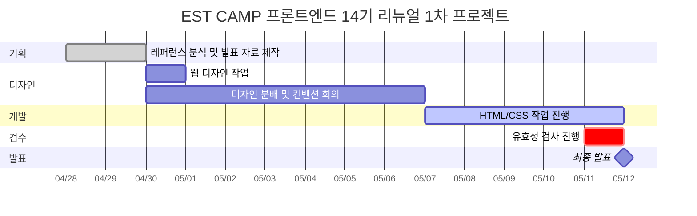
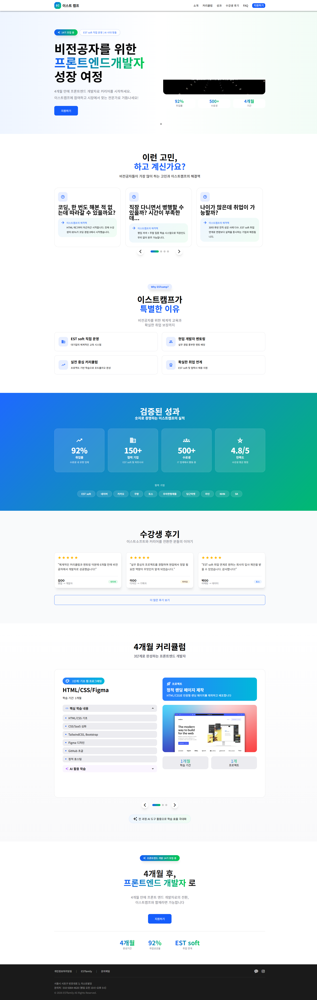

# EST CAMP Frontend 14th Renewal Project (1차 프로젝트)

> ESTsoft의 개발자 양성 프로그램 **EST CAMP 프론트엔드 14기 모집 페이지**를  
> 사용자 전환(Conversion) 중심 구조로 리뉴얼한 프로젝트입니다.

---

- 과정명 : 프로젝트기반 프론트엔드 개발자 양성
- 프로젝트 기간 : 2025/04/28 ~ 2025/05/12
- 프로젝트 차수 : 1차 프로젝트

---

# 🔗 빠른 링크

- 📑 [기획서 (Figma Slide)](https://www.figma.com/slides/CzlKmuxOolFBtCKjY7I2Cs)
- 🎨 [디자인 원본 (Figma)](https://www.figma.com/design/cW7HTzL1lrRohmqDPyWXby/%ED%94%84%EB%A1%9C%EC%A0%9D%ED%8A%B8-%EB%94%94%EC%9E%90%EC%9D%B8-%ED%98%84%EC%9E%AC-%EC%8A%A4%ED%86%A0%EB%A6%AC%EB%B3%B4%EB%93%9C-%EB%B0%8F-%EB%94%94%EC%9E%90%EC%9D%B8-?node-id=138-3672&t=oELWAzQ1IcYig6Ac-1)
- 🌐[EST CAMP Frontend 14th Renewal Project](https://jeju-ratus.github.io/est_fe13_1st_project/)

---

# 1. 프로젝트 개요

## 1.1 프로젝트 목표

기존 모집 랜딩페이지의 문제점을 분석하고,

- 전환(CTA) 구조 개선
- 콘텐츠 구조 개선
- UI/UX 개선
- 반응형 개선
- 접근성 및 웹표준 개선

을 목표로 리뉴얼 프로젝트를 진행하였습니다.

---

## 1.2 팀원

| 이름   | 역할                           | 주요 담당                                                               | GitHub                                            | 연락                    |
| ------ | ------------------------------ | ----------------------------------------------------------------------- | ------------------------------------------------- | ----------------------- |
| 송민혁 | 팀장 · FE 리드 · 기획 · 디자인 | 전체 총괄<br>git repo 충돌 관리<br>Hero seciton<br>solution seciton<Br> | [JEJU-Ratus](https://github.com/JEJU-Ratus)       | minhyeoksong3@gmail.com |
| 안건욱 | FE · 서브 · 기획 · 디자인      | 접근성 및 웹표준<br>Curriculum section                                  | [agw76638](https://github.com/agw76638)           | agw76638@gmail.com      |
| 김기용 | FE · 기획 · 디자인             | header<br>problem section                                               | [KIYONG00](https://github.com/KIYONG00)           | dhkdwk0292@gmail.com    |
| 남윤동 | FE · 기획 · 디자인             | CTA section<br>footer                                                   | [dbsehd125-bot](https://github.com/dbsehd125-bot) | dbsehd125@gmail.com     |
| 강형규 | FE · 디자인                    | result section<br>review section                                        | [hgkang2](https://github.com/hgkang2)             | hgkang2hank@gmail.com   |

---

## 1.3 마일스톤

### 04/28 ~ 4/29

- 레퍼런스 분석

### 04/29

- 레퍼런스 발표 자료 제작

### 04/30

- 웹 디자인 작업

### 04/30 ~ 05/06

- 디자인 분배
- 컨벤션 회의

### 05/07 ~ 5/11

- HTML/CSS 작업 진행

### 05-11

- 유효성 검사 진행

### 05-12

- 최종 발표

---

### 📊 간트차트



---

## 1.4 현황 분석

### 장점

- 상단 Sticky 메뉴를 통한 빠른 탐색 가능
- 정보 구조가 비교적 단순하여 가독성이 좋음
- 과도한 애니메이션이 없어 로딩 속도가 빠름

---

### 문제점

#### 1. 전환(CTA) 구조 문제

- 지원하기 버튼이 단 하나만 존재
- 사용자의 행동 유도가 약함

#### 2. 콘텐츠 구조 문제

- 커리큘럼 아코디언이 전체 펼침 상태
- 스크롤 길이가 과도하게 길어짐
- 수강 후기 및 취업 데이터 부족
- 결과 중심 콘텐츠보다 정보 나열 중심

#### 3. UI/UX 문제

- 일부 섹션의 정렬 불균형
- 모바일 전환 시 카드가 단순 1열 구조로 변경
- 모바일 스크롤 피로도 증가

#### 4. 인터랙션 문제

- 메인 영상 자동재생
- 영상 제어 기능 부재

#### 5. 디자인 방향성 문제

- 전체적으로 광고형 랜딩페이지 느낌이 강함
- 신뢰 중심보다는 홍보 중심 인상

#### 6. 접근성 및 기술적 문제

- 스크린리더 접근성 부족
- heading 구조 비논리적
- robots noindex 설정으로 SEO 노출 제한

---

## 1.5 제작 방향

### 1. 전환 중심 구조 재설계

- Sticky CTA 적용
- CTA 반복 노출
- 핵심 정보 상단 배치
- 스토리텔링 구조 도입

---

### 2. 콘텐츠 구조 및 신뢰 요소 강화

- 아코디언 요약형 구조 적용
- 후기 및 취업 데이터 강화
- 결과 중심 콘텐츠 재구성

---

### 3. UI/UX 및 반응형 개선

- 모바일 카드형 UI 적용
- 캐러셀 기반 탐색 구조
- Grid 시스템 기반 레이아웃 정리

---

### 4. 디자인 및 인터랙션 개선

- 광고형 톤 다운
- 신뢰 중심 비주얼 구성
- 핵심 인터랙션 강화
- 영상 제어 기능 제공

---

### 5. 웹표준 / 접근성 / SEO 개선

- 시맨틱 태그 사용
- heading 구조 개선
- 스크린리더 대응
- SEO 구조 개선

---

# 2. 개발 환경 및 배포

## 2.1 개발 스택

### Frontend

- HTML5
- CSS3

---

### Tools

- Git
- GitHub
- Figma

---

## 2.2 배포 URL

- [EST CAMP Frontend 14th Renewal Project](https://jeju-ratus.github.io/est_fe13_1st_project/)

---

## 2.3 개발 컨벤션 가이드

프로젝트에서 사용하는 HTML, CSS 작성 규칙은 아래 문서를 참고해주세요.

- [HTML/CSS 컨벤션](CONTRIBUTING.md)

---

# 3. 프로젝트 구조

```bash
est_fe13_1st_project/
├─ .github/
│  └─ CODEOWNERS
├─ .vscode/
│  └─ settings.json
├─ css/
│  ├─ common.css
│  ├─ index.css
│  ├─ normalize.css
│  └─ reset.css
├─ img/
│  └─ logo.png
├─ common.html
├─ CONTRIBUTING.md
├─ index.html
└─ README.md
```

---

# 4. 향후 개선 사항

## 개선 예정 사항

- 대형 모바일 기기 대응을 위한 반응형 레이아웃 개선
- 스크롤 기반 콘텐츠 등장 애니메이션 구현
- 접근성을 고려한 JavaScript 기반 모달 UI 추가
- 섹션 단위 스크롤 인터랙션 및 사용자 경험 개선

# 5. 제작 후기

## 제작 후기

- 프로젝트를 진행하며 협업 과정에서의 소통과 역할 분담의 중요성을 경험할 수 있었습니다.  
  기획부터 퍼블리싱까지 직접 구현하며 코드 구조와 UI 설계에 대한 이해를 높일 수 있었고,  
  부족한 부분을 확인하며 지속적인 학습의 필요성을 느낄 수 있었습니다.

## 팀원 한 줄 회고

- 송민혁 : 전체적인 코드 흐름과 협업 과정의 중요성을 배우며 더 성장하고 싶다는 목표를 갖게 되었습니다.
- 안건욱 : 팀원들과의 소통과 프로젝트 경험을 통해 새로운 협업 방식과 개발 역량을 배울 수 있었습니다.
- 강형규 : 코드 구조와 흐름에 대한 이해 부족을 느끼며, 더 깊이 있는 학습의 필요성을 깨달았습니다.
- 김기용 : 프로젝트를 통해 기초 지식과 꾸준한 학습의 중요성을 체감할 수 있었습니다.
- 남운동 : 개발 과정과 협업 흐름을 경험하며 커뮤니케이션과 지속적인 학습의 중요성을 느꼈습니다.

# 6. 기획 / 디자인 문서

## 📑 기획서 (Figma Slide)

- 사용자 흐름
- 요구사항 정의
- 스토리보드
- 발표 자료

🔗 https://www.figma.com/slides/CzlKmuxOolFBtCKjY7I2Cs

---

## 🎨 디자인 원본 (Figma)

- UI 디자인
- 반응형 구조
- 컴포넌트 설계
- 디자인 시스템

🔗 https://www.figma.com/design/cW7HTzL1lrRohmqDPyWXby/%ED%94%84%EB%A1%9C%EC%A0%9D%ED%8A%B8-%EB%94%94%EC%9E%90%EC%9D%B8-%ED%98%84%EC%9E%AC-%EC%8A%A4%ED%86%A0%EB%A6%AC%EB%B3%B4%EB%93%9C-%EB%B0%8F-%EB%94%94%EC%9E%90%EC%9D%B8-?node-id=138-3672&t=oELWAzQ1IcYig6Ac-1

---

# 7. 미리보기

<p align="center">
  
</p>
